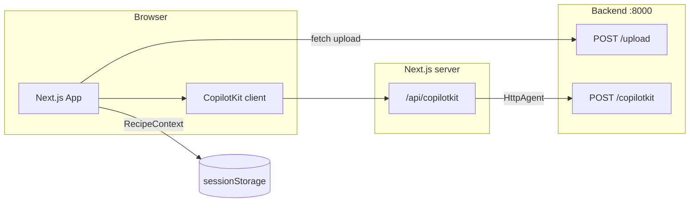

# Recipe Companion — Submission

Cooking companion for the **tablet-in-the-kitchen** brief: upload a recipe, explore a structured workspace, and chat with an agent that scales servings, substitutes ingredients, and updates progress. The **FastAPI + pydantic-ai backend** in `backend/` is challenge-provided; this submission adds the **Next.js frontend** in `frontend/`.

---

## Product walkthrough

1. **Upload** — Drop a PDF or plain text recipe. The app shows progress, then a handoff summary (servings, times, ingredient count).
2. **Browse** — Recipe header, tinted metadata tiles, checklist ingredients (scaled or substituted amounts highlighted against the original upload), and a step list aligned with agent state.
3. **Cooking mode** — Large step focus, sticky voice + step controls, optional “recipe & ingredients” drawer.
4. **Ask Chef** — CopilotKit popup wired to the backend AG-UI endpoint; the UI reacts to **`RecipeContext`** from tools, not to parsing chat text.
5. **Session** — `threadId` and state persist in `sessionStorage` so a refresh keeps the workspace coherent with the agent.

Design for **~1024×768**, touch-first, landscape-primary; mobile is a graceful fallback.

---

## Quick start (one command)

From the **repository root** (macOS / Linux / **Git Bash** on Windows):

```bash
chmod +x scripts/dev.sh   # once, if needed
./scripts/dev.sh
```

Then open **http://localhost:3000**.

What the script does:

- If **repo-root `.env`** exists and **Docker** is available → `docker compose up -d backend`, waits for `GET /health`, then starts Next.js.
- If a backend is **already** on port 8000 → skips Docker and starts Next.js.
- If the backend cannot be started automatically → prints the two manual options below; the dev server still starts so you can fix the API in parallel.

---

## Manual setup (full control)

### 1. Backend API keys

**Docker** (uses **repo-root** `.env`, same file `docker-compose.yml` references):

```env
LLM_MODEL=gemini-2.0-flash
GEMINI_API_KEY=your_key_here
```

Do **not** quote values (`docker-compose` passes them literally).

**Local uv** (from `backend/`): create `backend/.env` — see [backend/README.md](backend/README.md).

Gemini key: [Google AI Studio](https://aistudio.google.com/apikey).

### 2. Backend

```bash
docker compose up backend
```

or

```bash
cd backend && uv sync --extra test && uv run uvicorn src.main:app --reload --port 8000
```

OpenAPI: http://localhost:8000/docs — health: http://localhost:8000/health

### 3. Frontend

```bash
cd frontend
cp .env.example .env.local   # optional; defaults to http://localhost:8000
npm install
npm run dev
```

App: http://localhost:3000

---

## Environment reference

| Location | Purpose |
|----------|---------|
| **Repo root `.env`** | `docker compose` → backend container (LLM keys). |
| **`backend/.env`** | Running the backend with **uv** locally. |
| **`frontend/.env.local`** | `NEXT_PUBLIC_API_BASE_URL` (absolute URL of the API, default `http://localhost:8000`). |

CopilotKit from the browser hits **Next.js** at `/api/copilotkit`, which proxies to **`{NEXT_PUBLIC_API_BASE_URL}/copilotkit`** via `HttpAgent`.

---

## Architecture



- **`useRecipeCoAgent`** — Hydrates from session, syncs **`useCoAgent`** (`recipe_agent`) with backend `RecipeContext`; persists debounced snapshots when a recipe exists.
- **Features** — `components/features/upload` and `components/features/recipe`; **UI primitives** — `components/ui` (tokens, surfaces, typography, motion helpers).
- **Design tokens** — `frontend/app/globals.css` (OKLCH palette, spacing, elevation, motion).

More detail: [frontend/README.md](frontend/README.md), [backend/README.md](backend/README.md).

---

## UX rationale (major decisions)

| Decision | Reasoning |
|----------|-----------|
| **Tablet-first layout** | Matches the brief: arm’s-length reading, large tap targets, minimal reliance on hover. |
| **State-driven UI** | Ingredient scale/substitute/progress come from **tools → `RecipeContext`**; avoids brittle parsing of assistant text. |
| **Cooking mode** | Reduces cognitive load during active cooking; sticky controls support one-handed glances. |
| **Warm, calm visual system** | Kitchen context: paper-like canvas, soft plum accent, restrained motion (incl. `MotionConfig` / reduced-motion). |
| **Checklist + diff hints** | Checked items and scaled rows give closure; comparing to **original** upload makes agent changes legible. |
| **Debounced session writes** | Smooth tablet use when the agent updates state frequently. |

---

## Known tradeoffs

- **CopilotKit scope** — Wrapped at app root for a reliable runtime; narrower provider scope would need API compatibility checks.
- **Dynamic import of recipe workspace** — Improves first load on upload-only path; adds a short loading state when entering the recipe UI after upload.
- **Voice** — Depends on **Web Speech API** support (browser / permission); graceful degradation when unsupported.
- **Layout animations** — `framer-motion` `layout` on long lists has a cost on low-end tablets; kept for clarity of active step / ingredient transitions.
- **Docker vs uv** — Compose file only defines **backend**; frontend is always local Node for hot reload and reviewer familiarity.

---

## Demo & screenshots

**Suggested capture flow (for reviewers or portfolio):**

1. Browser device toolbar: **1024×768** (or real tablet).
2. Screenshot: upload dropzone + optional file strip.
3. Screenshot: post-upload handoff (stats tiles + CTA).
4. Screenshot: browse mode — ingredients + steps.
5. Screenshot: cooking mode + expanded “Recipe and ingredients”.
6. Short clip: ask the agent to scale servings or substitute an ingredient → watch the list update without trusting chat text.

Sample data: see `data/` at repo root (PDF/recipe samples) if your clone includes them.

---

## Repository layout

```text
Code-Challenge/
├── README.md                 # This submission guide
├── docker-compose.yml        # Backend service
├── scripts/dev.sh            # One-shot local dev entrypoint
├── backend/                  # Challenge backend (FastAPI, AG-UI)
├── data/                     # Sample recipes (if present)
└── frontend/
    ├── README.md             # Frontend-focused developer notes
    ├── app/                  # Next.js App Router, CopilotKit route
    ├── components/           # features/, layout/, ui/
    ├── hooks/                # Co-agent, upload, voice
    ├── lib/                  # API client, session, recipe context
    └── config/               # env, Copilot agent name
```

---

## Submission checklist

- [ ] Repo-root **`.env`** (Docker) or **`backend/.env`** (uv) with a valid **`LLM_MODEL`** and provider key — **unquoted** values.
- [ ] **`./scripts/dev.sh`** or manual backend + **`cd frontend && npm install && npm run dev`**.
- [ ] **http://localhost:8000/health** returns healthy before exercising upload/chat.
- [ ] **`frontend/.env.local`** points at the API if not using default `http://localhost:8000`.
- [ ] Golden path: upload → recipe view → chat scale/substitute → UI updates from state.
- [ ] **`npm run lint`** and **`npm run typecheck`** in `frontend/` pass.
- [ ] Git history reflects incremental, readable commits (reviewers often skim log).

Quality scripts in `frontend/`: `lint`, `typecheck`, `build`, `format:check`.

---

## Quality of life (frontend)

```bash
cd frontend
npm run lint          # ESLint
npm run typecheck     # TypeScript
npm run build         # Production build
```

---

## Challenge contact

If the original brief is ambiguous: **tolo.palmer@indegene.com** (as in the source challenge text).

AI-assisted development is explicitly allowed; outcomes and explainability matter more than keystrokes. Tooling notes for assistants: [agents.md](agents.md).

---

## Licence / confidentiality

Treat this repository per your agreement with the challenge organiser. The backend is provided for evaluation; the frontend is candidate work.
